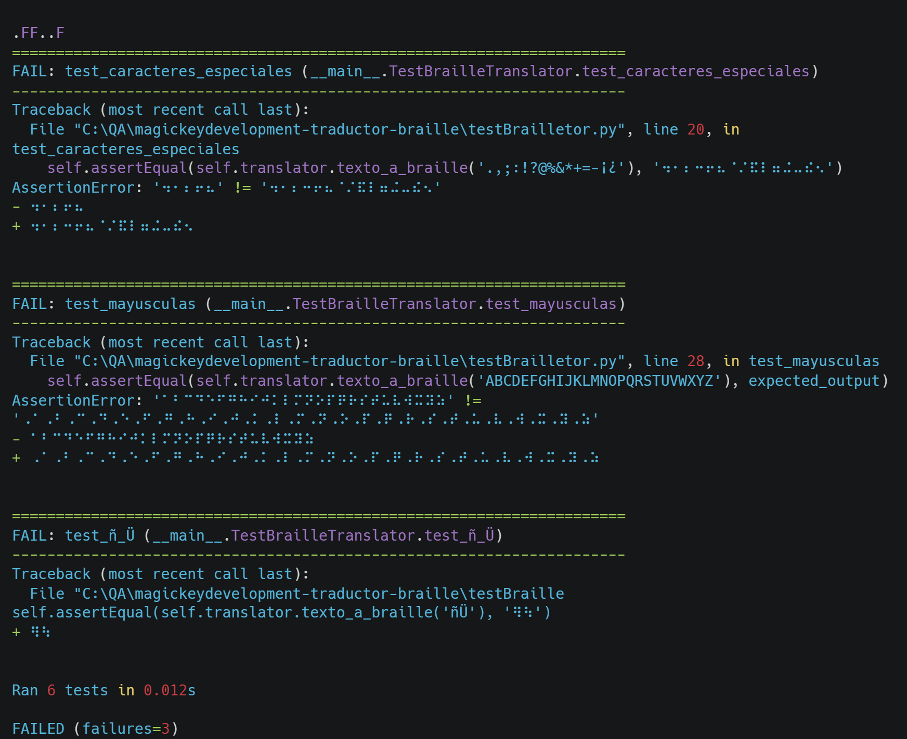

# Prueba Unitaria del Traductor Braille

Esta prueba unitaria evalúa el reconocimiento de caracteres para la traducción a Braille utilizando la clase BrailleTranslator.

## Objetivo de la Prueba

El objetivo de esta prueba es verificar que el método `texto_a_braille()` de la clase BrailleTranslator pueda reconocer correctamente varios tipos de caracteres y traducirlos a su equivalente en Braille.

## Descripción de los casos de prueba

1. **setUpClass**: Este método inicializa un objeto BrailleTranslator con el archivo 'brailleDictionary.txt' para preparar la prueba.

2. **test_vocales_acentuadas**: Este test verifica la traducción correcta de vocales acentuadas ('áéíóú') a su representación en Braille.

3. **test_abecedario**: Se evalúa si el abecedario completo ('abcdefghijklmnopqrstuvwxyz') se traduce correctamente a Braille.

4. **test_numeros**: Se comprueba la traducción adecuada de números ('0123456789') a su equivalente Braille.

5. **test_caracteres_especiales**: Este test verifica la traducción de caracteres especiales (',.;:!?@%&*+=-¡¿') a su representación en Braille.

6. **test_ñ_Ü**: Se evalúa si los caracteres especiales ('ñ' y 'Ü') se traducen correctamente a Braille.

## Cómo Ejecutar la Prueba

Para ejecutar esta prueba unitaria, ejecute el modulo `testBrailleTranslator` utilizando un marco de pruebas como `unittest`. Asegúrese de que las dependencias y los archivos necesarios, incluido 'brailleDictionary.txt', estén disponibles en el entorno de prueba.

Puede hacer uso de:

```terminal
python -m unittest testBrailleTranslator.py
```


## Resultado de la Prueba

Al ejecutar el test se obtuvo el resultado:



El resultado de la prueba muestra que hubo 3 fallos en la traducción de los caracteres especiales, las mayúsculas y los caracteres especiales ('.,;:!?@%&*+=-¡¿'). 

Los caracteres especiales ('ñ' y 'Ü') también fallaron en la traducción a Braille.

