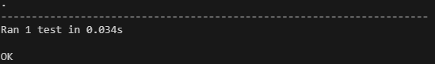

# Prueba de Integración del Traductor Braille

Esta prueba de integración se centra en verificar la funcionalidad de generar imágenes Braille a partir de texto utilizando las clases BrailleTranslator y BrailleImageGenerator.

## Objetivo de la Prueba

El objetivo de esta prueba es asegurar que el proceso de generar imágenes Braille a partir de texto funcione correctamente. Se verifica si la clase BrailleImageGenerator puede convertir con precisión el texto de entrada en símbolos Braille y crear un archivo de imagen correspondiente.

## Descripción de la Prueba

1. **setUpClass**: Este método inicializa los objetos BrailleTranslator y BrailleImageGenerator utilizando el archivo 'braille_dict.txt' y los prepara para la prueba.

2. **test_generate_braille_image**: Este método de prueba genera una imagen Braille a partir del texto "Hola Mundo" utilizando el método generar_senaletica_braille() de la clase BrailleImageGenerator. Luego, verifica si el archivo de salida 'test_braille.png' se crea correctamente y lo elimina después de que la prueba se complete.

## Cómo Ejecutar la Prueba

Para ejecutar esta prueba de integración, ejecute el módulo `testIntegration` utilizando un marco de pruebas como `unittest`. Asegúrese de que las dependencias y los archivos necesarios, incluido 'brailleDictionary.txt', estén disponibles en el entorno de prueba.

Comando de ejemplo:

```terminal
python -m unittest test_integration.py
```


## Resultado Esperado

Al ejecutar la prueba, se espera que la imagen Braille para el texto "Hola Mundo" se genere correctamente y que el archivo de salida 'test_braille.png' se cree en el directorio de prueba.

## Resultado obtenido

Al ejecutar el test se obtuvo el siguiente resultado:



Mostrando que efectivamente funciona la generaciónde imágenes.

