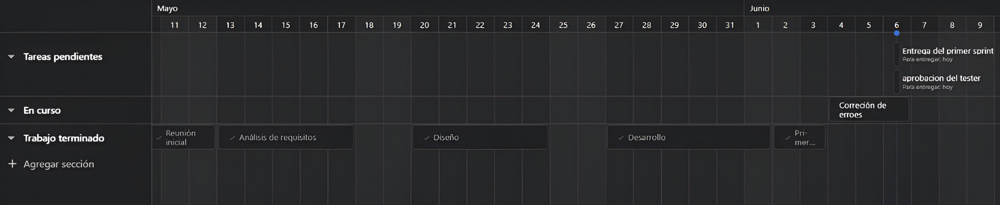

# Calidad de Software

## GR2SW

## MagicKey Development

### Integrantes

- Victor Rodriguez
- Karina Arichavala
- Dayana Lema
- Matias Villareal
- Gilson Cango
## 1. Cronograma de trabajo

## 2. Análisis

Historias de Usuario

| Historia de Usuario |                |
|----------------------|-----------------|
| Número:              | 1               |
| Usuario:             | Usuario        |
| Nombre historia:     | Transcripción de textos del español a braille |
| Prioridad en negocio: | Alta          |Riesgo en desarrollo: | Baja |
| Puntos estimados:    | 2              | Iteración asignada: | 1    |
| Descripción:         | Como usuario, quiero poder transcribir textos del español al sistema de escritura braille, incluyendo números, abecedario, vocales acentuadas y signos básicos, para que pueda generar contenido accesible para personas con discapacidad visual. |

| Criterios de aceptación |                |
|----------------------|-----------------|
| Número de HU:              | 1               |
| Descripción:               |                 | 

| Historia de Usuario |                |
|----------------------|-----------------|
| Número:              | 2               |
| Usuario:             | Usuario        |
| Nombre historia:     | Transcripción de textos de braille a español |
| Prioridad en negocio: | Alta          | Riesgo en desarrollo: | Baja |
| Puntos estimados:    | 2              | Iteración asignada: | 1    |
| Descripción:         | Como usuario, quiero poder transcribir textos escritos en braille al español, para poder entender el contenido escrito en braille. |

| Criterios de aceptación |                |
|----------------------|-----------------|
| Número de HU:              | 2               |
| Descripción:               |                 | 

| Historia de Usuario |                |
|----------------------|-----------------|
| Número:              | 3               |
| Usuario:             | Usuario        |
| Nombre historia:     | Generación de señaléticas en braille |
| Prioridad en negocio: | Alta          | Riesgo en desarrollo: | Baja |
| Puntos estimados:    | 2              | Iteración asignada: | 1    |
| Descripción:         | Como usuario, quiero poder generar señalética en braille a partir de textos en español, para mejorar la accesibilidad de edificios, aparatos, juegos de mesa, prendas de vestir, medicamentos, alimentos empacados, etc. |

| Criterios de aceptación |                |
|----------------------|-----------------|
| Número de HU:              | 3               |
| Descripción:               |                 | 

| Historia de Usuario |                |
|----------------------|-----------------|
| Número:              | 4               |
| Usuario:             | Usuario        |
| Nombre historia:     | Generación de impresiones en espejo |
| Prioridad en negocio: | Alta          | Riesgo en desarrollo: | Baja |
| Puntos estimados:    | 2              | Iteración asignada: | 1    |
| Descripción:         | Como usuario, quiero poder generar impresiones en espejo de textos braille, para poder escribir manualmente en braille utilizando un punzón y una regleta. |

| Criterios de aceptación |                |
|----------------------|-----------------|
| Número de HU:              | 4               |
| Descripción:               |                 | 

| Historia de Usuario |                |
|----------------------|-----------------|
| Número:              | 5               |
| Usuario:             | Usuario        |
| Nombre historia:     | Traducción y generación de impresiones guía |
| Prioridad en negocio: | Alta          | Riesgo en desarrollo: | Baja |
| Puntos estimados:    | 2              | Iteración asignada: | 1    |
| Descripción:         | Como usuario, quiero que el sistema se limite a la traducción entre español y braille, y a la generación de impresiones guía, sin incluir funcionalidades adicionales como idiomas adicionales, impresión braille 3D o enseñanza de braille. |

| Criterios de aceptación |                |
|----------------------|-----------------|
| Número de HU:              | 5               |
| Descripción:               |                 | 

## 3. Diseño

**Módulos**

**BrailleTranslator**

` `Esta clase maneja la lógica central de la traducción. Carga un diccionario Braille desde un archivo de texto y proporciona métodos para traducir texto a Braille y viceversa.

**BrailleImageGenerator** 

Esta clase maneja la generación de imágenes Braille basadas en el texto traducido. Puede generar una imagen de texto simple que represente el Braille o una versión espejo para imprimir en PNG.

**BrailleApp** 

Esta clase construye la interfaz gráfica de usuario utilizando la librería Tkinter. Crea una ventana con etiquetas, cuadros de texto y botones para que los usuarios interactúen con la aplicación.

**Interacción de Módulos**

- **Flujo de Traducción**

Usuario introduce texto en español: El usuario ingresa texto en el cuadro de texto "Español" (text\_esp) de la interfaz gráfica de usuario GUI.

- **Traducción a Braille**

La aplicación llama al método texto\_a\_braille() de la clase BrailleTranslator.

Este método consulta el diccionario Braille cargado (archivo 'brailleDictionary.txt') para convertir cada carácter del texto en Español a su correspondiente representación en Braille.

El texto Braille traducido se almacena en una variable temporal de la interfaz gráfica.

- **Visualización del Texto Braille**

El texto Braille traducido se inserta en el cuadro de texto "Braille" (text\_brl) de la GUI.

El usuario puede visualizar la representación Braille del texto ingresado.

- **2. Generación de Imagen Braille**

Usuario selecciona opción "Generar Señalética Braille": El usuario hace clic en el botón "Generar Señalética Braille" de la GUI.

- **Creación de Imagen Braille**

La aplicación llama al método generar\_senaletica\_braille() de la clase BrailleImageGenerator.

Este método recibe el texto en Español como entrada.

El método genera una imagen PNG que representa el texto Braille utilizando una fuente Braille adecuada.

La imagen se guarda en un archivo con nombre "senaletica.png".

- **Notificación al Usuario**

Se muestra un mensaje emergente al usuario indicando que la imagen Braille se ha generado y guardado en "senaletica.png".

- **Impresión Espejo de Braille**

Usuario selecciona opción "Imprimir en Espejo": El usuario hace clic en el botón "Imprimir en Espejo" de la GUI.

Generación de Braille Espejo:

La aplicación llama al método imprimir\_en\_espejo\_braille() de la clase BrailleImageGenerator.

Este método recibe el texto en español como entrada.

El método genera una versión invertida (espejo) del texto Braille.

El texto Braille invertido se muestra en el cuadro de texto "Braille" (text\_brl) de la GUI.

- **Preparación para Impresión**

El usuario puede imprimir el texto Braille invertido en un material adecuado para Braille físico.

- **Comunicación entre Componentes**

**Uso de Métodos:** Los componentes se comunican entre sí mediante llamadas a métodos definidos en las clases.

**Paso de Datos:** Los métodos reciben y pasan datos entre sí, como el texto en español, el texto Braille traducido, y la imagen generada.

**Interfaz Gráfica:** La GUI actúa como intermediario entre el usuario y los componentes internos, permitiendo la interacción y el flujo de información.

**Decisiones de Diseño**

- **Enfoque Orientado a Objetos (POO)**

Se implementa una estructura modular utilizando clases separadas para cada componente principal: BrailleTranslator, BrailleImageGenerator y BrailleApp.

Esta modularidad promueve la organización del código, la reutilización de componentes y facilita el mantenimiento a largo plazo.

Cada clase encapsula su propia lógica y datos, ocultando la implementación interna y mejorando la independencia de los componentes.

- **Interfaz Gráfica de Usuario (GUI) con Tkinter:**

Se utiliza la librería Tkinter para crear la interfaz gráfica de usuario (GUI) de la aplicación.

Tkinter es una librería liviana y fácil de usar, lo que simplifica el desarrollo de la GUI y la hace accesible a una amplia gama de usuarios.

La GUI proporciona una interfaz intuitiva con elementos como cuadros de texto, botones y mensajes, permitiendo a los usuarios interactuar fácilmente con la aplicación.

- **Carga de Diccionario Braille desde Archivo**

El diccionario Braille se carga desde un archivo de texto externo ('brailleDictionary.txt').

Esta estrategia permite actualizar el diccionario con nuevos caracteres Braille o modificar las representaciones existentes sin necesidad de modificar el código fuente de la aplicación.

Aumenta la flexibilidad y adaptabilidad de la aplicación a diferentes necesidades y estándares Braille.

- **Generación de Imágenes Braille:**

La funcionalidad de generación de imágenes Braille permite a los usuarios obtener representaciones visuales del texto traducido.

- **Impresión Espejo de Braille:**

Al imprimir el Braille en espejo, se obtiene una imagen invertida que, al ser vista a través de un material transparente, muestra el texto correctamente orientado.

Esta funcionalidad facilita la creación de materiales Braille accesibles para personas con discapacidades visuales.

- **Manejo de Errores y Retroalimentación al Usuario:**

La aplicación proporciona retroalimentación visual al usuario sobre el estado de las operaciones, como la finalización exitosa de la traducción o la generación de la imagen Braille.

**Diagrama de clases UML**

[!Diagrama de clases UML](images/classDiagramUML.jpeg)

# Construcción y evolución de Software
## Flujo de Trabajo Feature Branch Workflow
### Descripción del Flujo de Trabajo

Nuestro equipo utiliza un flujo de trabajo estructurado en Git para separar claramente las fases de desarrollo y testing en ramas dedicadas. Este flujo de trabajo asegura la estabilidad y calidad del código antes de que llegue a producción.

#### Ramas

- **`main`**: Esta rama se mantiene siempre estable y contiene la documentación.
- **`develop`**: Esta rama es donde se realiza el desarrollo activo de nuevas características y funcionalidades. Todos los desarrolladores colaboran en esta rama.
- **`testing`**: Ramas dedicadas para pruebas.
  - **`testing/image-generation`**: En esta rama se prueba la funcionalidad en general.
  - **`testing/character-recognition`**: En esta rama se hacen pruebas unitarias.
- **`preliminar-docs`**: contiene la documentación preliminar antes de enviarla al `main`.
#### Pasos del Flujo de Trabajo

1. **Desarrollo**:
   - Los desarrolladores trabajan en la rama `develop`.
   - Cada nueva característica o cambio se implementa en esta rama.
   - Cuando se completa una característica, se realiza una revisión de código (code review) a través de un pull request.

2. **Testing**:
   - Desde `develop`, se fusiona en las ramas de testing específicas:
     - **`testing/image-generation`**
     - **`testing/character-recognition`**
   - El tester realiza pruebas en estas ramas.
   - Si se encuentran errores, se corrigen en la rama de desarrollo `develop` y luego se vuelven a fusionar en las ramas de testing para retesting.

3. **Documentación Preliminar**:
   - La documentación preliminar se realiza en la rama `preliminar-docs`.
   - Una vez que la documentación está completa y revisada, se fusiona en `main`.

4. **Producción**:
   - Una vez que el código en la rama `testing` ha pasado todas las pruebas, se fusiona en la rama `main`.
   - La rama `main` contiene el código listo para ser desplegado en producción.

## Documentación del ambiente de desarrollo

### Lenguaje de Programación

- **Python**: Utilizamos la versión 3.12.3, la cual se puede descargar desde [python.org](https://www.python.org/downloads/release/python-3123/).

### Editor de Código

- **Visual Studio Code**: Se utilizó VS Code como editor de código, se puede descargar desde [code.visualstudio.com](https://code.visualstudio.com/).

## Instalación del Ambiente de Desarrollo

### Instalación de Python

1. Descargar el instalador de Python 3.12.3 en el enlace que se indicó con anterioridad.
2. Ejecutar el instalador y seguir las instrucciones para completar la instalación.

### Instalación de Visual Studio Code

1. Descargar el instalador de VS Code en el enlace que se indicó con anterioridad.
2. Ejecutar el instalador y seguir las instrucciones para completar la instalación.

### Configuración del Ambiente de Desarrollo

1. **Instalar extensiones recomendadas en VS Code**:
    - Python: Esta extensión proporciona soporte para Python en VS Code.

2. **Configurar el intérprete de Python**:
    - Abrir VS Code y seleccionar el intérprete de Python 3.12.3:
        - Presionar `Ctrl+Shift+P` para abrir la paleta de comandos.
        - Escribir `Python: Select Interpreter` y seleccionar la versión 3.12.3.

